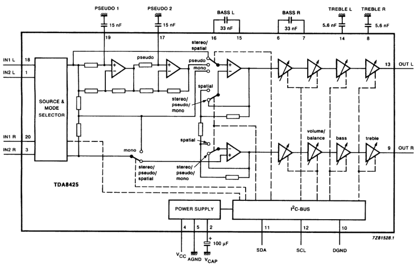
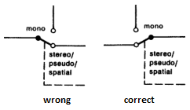
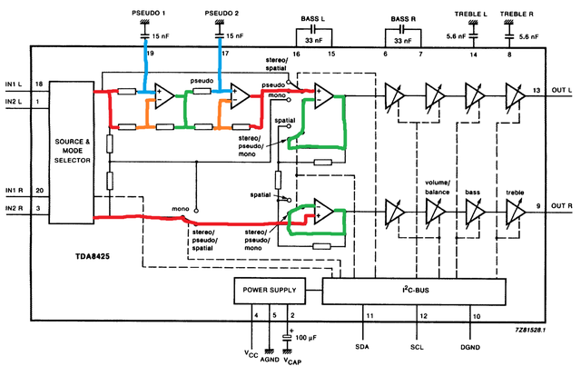
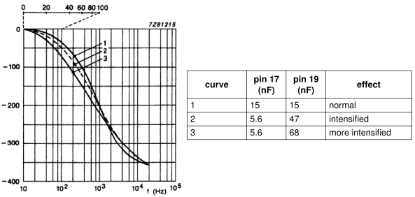
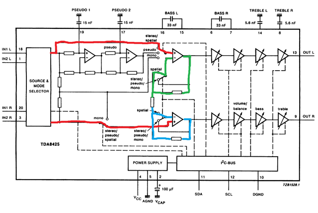
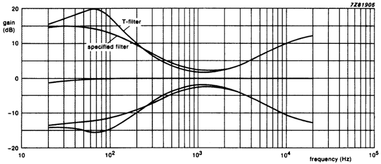

# TDA8425

This library aims to emulate the
[*Philips Semiconductors TDA8425* Hi-fi stereo audio processor](doc/TDA8425.pdf).

The original goal is to contibute to the emulation of the *AdLib Gold* sound
card, which used such integrated circuit to add sound effects to the audio
output, as heard in the beautiful soundtrack of the *Dune* videogame, made
specifically for that rare sound card.

As I do not know how the actual circuits are made, I cannot emulate the chip
perfectly. Instead, my goal is to simulate the overall sound, based on the
short information available.

If anybody can analyze a decapped chip, that would of course be the best
information, as already done for many vintage sound chips.

I am willing to get some real chips, as long as they are available for
purchase, at least for black-box comparisons with dedicated test vectors.

_______________________________________________________________________________

## Usage

To use this library, just include `TDA8425_emu.c` and `TDA8425_emu.h`
into your project.

The engine implements the following conceptual flow:

1. Chip memory allocation.
2. Call **Ctor()** to invalidate internal data.
3. Call **Setup()** to initialize static settings.
4. Call **Reset()** to clear emulated registers.
5. Call **Write()** for each register to inizialize.
6. Call **Start()** to start the algorithms.
7. Processing loop:
    1. Call **Process()** for each sample, with appropriate data types.
8. Call **Stop()** to stop the algorithms.
9. Call **Dtor()** to deallocate and invalidate internal data.
10. Chip memory deallocation.

Register access timings are not emulated.

You can give a look at the [TDA8425_pipe example](example/TDA8425_pipe.c) for
more details.

_______________________________________________________________________________

## Implementation details

Here you can find some descriptions and discussions about implementation
details.

### Language

I chose *C99*, because I find good old and mature C to be the best for such a
tiny library. C is also easier to integrate with other languages.

### Cross-platform support

The code itself should be cross-platform and clean enough not to give
compilation errors or ambiguity.

Currently the library is developed and tested under *Windows* with *MSVC++14*.
Of course, I will at least provide support for *gcc* and *clang* under *Linux*.
I do not have access to *macOS*, but I guess the *Linux* support should fit.

### Code style

I chose the path of verbosity for variable declaration, to help debugging fixed
point math and buffering. Indeed, when compiled for performance, all those
variable declarations get optimized away easily.

### Input selector

The input selector simply chooses which channels to feed to the internal
processing units.

The *Process()* method is always provided with two stereo sources.

_______________________________________________________________________________

## Stereo modes

### Forced mono

The *forced mono* mode simply adds the two input channels together, duplicating
the summed signal.

It looks like there is an error in the datasheet, where a switch on the right
channel is flipped, leading to some weird path, while it is clear that it would
simply feed the opamp with the sum of the two channels, just like for the left
channel:

### Linear stereo

The *linear stereo* mode does not alter the two input channels.

### Pseudo stereo

The *pseudo stereo* mode applies two cascaded all-pass filters to the left
channel.

All-pass filters can be configured by changing the external capacitance, as per
an actual chip. The library provides the three preset values mentioned in the
datasheet.

The datasheet describes the pseudo stereo with a clear schematic.
By knowning the phase diagram and the associated capacitance values, it is
possible to calculate the internal resistance values.
The script [TDA8425_pseudo.py](doc/TDA8425_pseudo.py) was used in the
development, to expand the expressions to calculate the biquad coefficients.
It also helped in the identification of internal resistance values, which
should be around 15 kΩ, but it looks like the plots on the datasheet are not as
accurate as those of the script.

The filter as a whole is implemented as a *biquad* filter.

### Spatial stereo

The *spatial stereo* simply adds some cross-talk between the channels.

The relationship between generic channels *a* and *b* is the following:

    Voa(t) = Via(t) + Rfa/Rc * (Via(t) - Vib(t))

where `Rfa/Rc` is 52%.

A simple ideal circuit is emulated in the *SPICE* model:
[TDA8425_spatial.asc](doc/TDA8425_spatial.asc).

_______________________________________________________________________________

## Tone control

The datasheet plots the frequency response diagrams of two filters: the
*specified* one, and the mysterious (at least for me) *T-filter*.

The *specified* filter is a classic Baxandall-like tone control, with single
pole/zero shelving filters for both bass and treble controls.
It looks like the they are centered around 300 Hz and 4500 Hz, respectively.
I designed two *biquad* filters around such frequencies, with the help of the
[TDA8425_shelving.py](doc/TDA8425_shelving.py) Python script.

I chose *bi-linear* instead of *bi-quadratic* for both filters, to maintain
separation of concerns.

Furthermore, it looks like the *T-filter* has an additional second-order
frequency response for bass control, which can be factored into a dedicated
biquad filter.
I have some ideas about how to design such a bass shelving filter with
resonance around 40 Hz, but for now I will stick to the simpler *specified*
design.

_______________________________________________________________________________

## TDA8425_pipe example

This repository provides a fully-featured example. It is a stream processor, in
that it processes sample data coming from *standard input*, elaborates it, and
generates outputs on the *standard output*.

Please refer to its own help page, by calling the canonical
`TDA8425_pipe --help`, or reading it embedded in
[its source code](example/TDA8425_pipe.c).
