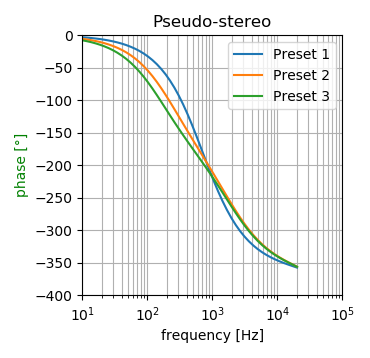

# TDA8425

This library aims to emulate the
[*Philips Semiconductors TDA8425* Hi-fi stereo audio processor](doc/TDA8425.pdf).

The original goal is to contibute to the emulation of the *AdLib Gold* sound
card, which used such integrated circuit to add sound effects to the audio
output, as heard in the beautiful soundtrack of the *Dune* videogame, made
specifically for that rare sound card.

As I do not know how the actual circuits are made, I cannot emulate the chip
perfectly. Instead, my goal is to simulate the overall sound, based on the
short information available.

If anybody can analyze a decapped chip, that would of course be the best
information, as already done for many vintage sound chips.

I am willing to get some real chips, as long as they are available for
purchase, at least for black-box comparisons with dedicated test vectors.

_______________________________________________________________________________

## Usage

To use this library, just include `TDA8425_emu.c` and `TDA8425_emu.h`
into your project.

The engine implements the following conceptual flow:

1. Status memory allocation.
2. Call *Ctor()* method to invalidate internal data.
3. Call *Setup()* method to initialize static settings.
4. Call *Reset()* method to clear emulated registers.
5. Call *Write()* for each register to inizialize.
6. Call *Start()* to start the algorithms.
7. Processing loop:
    1. Call *Process()* method for each sample, with appropriate data types.
8. Call *Stop()* method to stop the algorithms.
9. Call *Dtor()* method to deallocate and invalidate internal data.
10. Status memory deallocation.

Register access timings are not emulated.

_______________________________________________________________________________

## Implementation details

Here you can find some descriptions and discussions about implementation
details.

### Language

I chose *C89* with a bit of *C99*. I was going to use *C++20* for my own
pleasure, but instead I find good old and mature C to be the best for such a
tiny library. C is also easier to integrate with other languages, and the
mighty features of a colossal language like C++ are more of a burden than for
actual use in such case.

### Cross-platform support

The code itself should be cross-platform and clean enough not to give
compilation errors or ambiguity.

Currently the library is developed and tested under *Windows* with *MSVC++ 14*.
Of course, I will at least provide support for *gcc* and *clang* under *Linux*.
I do not have access to *macOS*, but I guess the *Linux* support should fit.

### Code style

I chose the path of verbosity for variable declaration, to help debugging fixed
point math and buffering. Indeed, when compiled for performance, all those
variable declarations get optimized away easily.

I did not write the code for explicit vectoring, preferring a *KISS* approach
at this stage of development. Actually I am not satisfied about how the
*MSVC++* compiler is generating machine code, and I guess that optimizing the
code for vectoring should improve the performance by some margin, especially
the parts for parallel 8-tap delay and output oversampling.

### Input selector

The input selector simply chooses which channels to feed to the internal
processing units.

### Pseudo stereo

The *pseudo stereo* mode duplicates the input left channel, keeping the fake
right channel as-is, and applying a two-fold all-pass filter to the fake left
channel.

All-pass filters can be configured by changing the external capacitance, as per
an actual chip. The library provides the three preset values mentioned in the
datasheet.

The datasheet describes the pseudo stereo as two cascaded classic all-pass
filter stages, with a clear schematic. By knowning the phase diagram and the
associated capacitance values, it is possible to calculate the internal
resistance values from *curve 1*, which is symmetrical and centered around
800 Hz. This leads to internal resistances of around 13 kΩ.

The filter as a whole is implemented as a classic *biquad* filter.

### Spatial stereo

Looking at the schematic of the datasheet, it looks like the *spatial stereo*
is simply a common-mode attenuator, to reduce the weight of the *middle*
channel in an equivalent *mid-side* (*M-S*) model.

